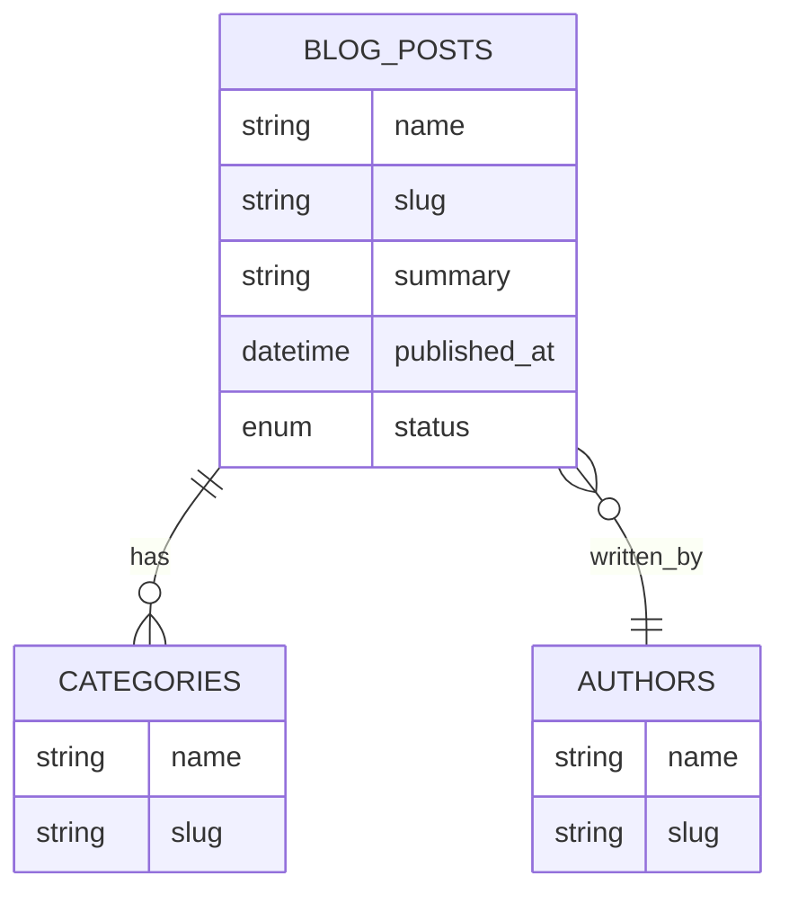

# Webflow MCP — CMS ERD Ruleset (cms-erd.md)

## Goals

1. Ask for CMS requirements and produce a clear, machine friendly ERD plan.
2. Write `ERD-PLAN.md` in a clear, human way at `/webflow/cms/{site-name}/` for review and edits.
3. After approval, build collections, fields, and any seed items. Then update `ERD-PLAN.md` with the applied state and IDs.

---

## Webflow MCP abilities the agent may use

* collections - list
* collections - get
* collections - create
* collection - fields - create - static
* collection - fields - create - option
* collection - fields - create - reference
* collection - fields - update
* collections - items - list - items
* collections - items - create - item
* collections - items - create - item - live
* collections - items - update - items
* collections - items - update - items - live
* collections - items - publish - items

The agent should prefer staged create and publish in batches unless `publish_mode: immediate` is set in the plan.

---

## Intake — questions the agent must ask once

Ask these to collect requirements. Record answers in `ERD-PLAN.md` under `context:`.

* Site name and base URL
* Primary entities and their relationships. Example: Blog has Posts, Authors, Categories, Tags
* Cardinalities for each relation. One to one, one to many, many to many
* Required fields and validation rules per entity
* Field types and constraints. Text, Rich text, Switch, Number, Date, Color, Image, File, Video link, Email, Phone, URL, Option, Reference, Multi reference, Map
* Slug patterns per collection. Example: `/blog/{slug}`, `/category/{slug}`
* Option sets for enums. Example: status draft, scheduled, published
* Reference integrity rules. Example: Post must have at least one Category
* Default values
* Seed items needed for launch. Provide minimal seed lists if any
* Migration constraints if collections already exist. Additive only, or allow breaking changes through new versions
* Publish mode. `immediate`, `staged_then_publish`, or `staged_only`

If anything is unclear, propose a sensible default and continue.

---

## Mapping — abstract ERD types to Webflow fields

| Abstract type | Webflow CMS field |
| ------------- | ----------------- |
| string        | Plain text        |
| text\_long    | Rich text         |
| boolean       | Switch            |
| number        | Number            |
| date          | Date/Time         |
| enum          | Option            |
| color         | Color             |
| url           | Link              |
| email         | Email             |
| phone         | Phone             |
| image         | Image             |
| file          | File              |
| reference     | Reference         |
| reference\[]  | Multi reference   |
| location      | Map               |

Notes

* Every collection has built in Name and Slug fields. Do not duplicate Name. Only add a separate slug if needed for special routing.
* Use Reference for 1 to many or 1 to 1. Use Multi reference when an item can link to many targets without ordering.
* For many to many with attributes, create a join collection that references both sides.

---

## Naming and IDs

* Collection `label_singular` and `label_plural` are human friendly. `api_id` is lowercase kebab. Example: `blog-posts`
* Field `api_id` is lowercase kebab. Example: `published-at`, `hero-image`
* Keep names stable. Renames can break bindings. Use new fields and map values when needed.

---

## Plan file schema — `/webflow/cms/{site-name}/ERD-PLAN.md`

The agent writes and maintains this file. You edit it and flip statuses.

````markdown
# ERD Plan

## Summary

```yaml
version: "1.0"
generated_at: "YYYY-MM-DDThh:mm:ssZ"
site_name: "<Your Site>"
base_url: "https://example.com"
publish_mode: "staged_then_publish"   # immediate | staged_then_publish | staged_only
````

## Context

```yaml
context:
  purpose: "Describe the CMS goals"
  assumptions:
    - "Additive changes only"
    - "Blog needs SEO fields"
  routes:
    - collection: "blog-posts" pattern: "/blog/{slug}"
    - collection: "authors" pattern: "/team/{slug}"
```

## Entities

```yaml
entities:
  - api_id: "blog-posts"
    label_singular: "Blog Post"
    label_plural: "Blog Posts"
    description: "Articles for the blog"
    fields:
      - api_id: "summary"
        type: "text_long"
        required: true
      - api_id: "hero-image"
        type: "image"
        required: false
      - api_id: "published-at"
        type: "date"
        required: true
      - api_id: "status"
        type: "enum"
        options: ["draft", "scheduled", "published"]
        required: true
      - api_id: "author"
        type: "reference"
        references: "authors"
        required: true
      - api_id: "categories"
        type: "reference[]"
        references: "categories"
        required: false
    unique_constraints:
      - "slug"   # keep slugs unique in the collection
    default_sort: { field: "published-at", order: "desc" }

  - api_id: "authors"
    label_singular: "Author"
    label_plural: "Authors"
    description: "People who write posts"
    fields:
      - api_id: "bio"
        type: "text_long"
        required: false
      - api_id: "avatar"
        type: "image"
        required: false

  - api_id: "categories"
    label_singular: "Category"
    label_plural: "Categories"
    description: "Post categories"
    fields: []
```

## Relationships

```yaml
relationships:
  - from: "blog-posts.author"
    to: "authors"
    cardinality: "many_to_one"
    on_delete: "restrict"
  - from: "blog-posts.categories"
    to: "categories"
    cardinality: "many_to_many"
    via: "post-categories"   # optional join collection
```

## Seed

```yaml
seed:
  blog-posts:
    - name: "Hello World"
      slug: "hello-world"
      summary: "First post"
      status: "published"
      published-at: "2025-01-01T12:00:00Z"
      author: "<match by name or slug>"
      categories: ["general"]
  authors:
    - name: "Jane Doe"
      slug: "jane-doe"
      bio: "Writer"
  categories:
    - name: "General"
      slug: "general"
```

## Status

```yaml
status:
  plan_state: "proposed"   # proposed | approved | created | verified
  approvals:
    approved_by: "<name>"
    approved_at: "YYYY-MM-DDThh:mm:ssZ"
```

## ER Diagram



````

---

## Execution phases

### Phase 1 — Discover and draft the plan

1. Ask the intake questions. Consolidate answers.
2. Create the folder `/webflow/cms/{site-name}/` if missing.
3. Write `ERD-PLAN.md` with the schema above.
4. Set `status.plan_state: proposed`.
5. Render the ER diagram from the `entities` and `relationships` blocks.
6. Stop and request review. Wait for the user to flip `plan_state` to `approved`.

### Phase 2 — Validate and dry run

1. Read `ERD-PLAN.md`. Confirm required keys exist.
2. List existing Webflow collections. Map by `api_id`.
3. Compute a diff: create, update, or keep for each collection and field.
4. Detect breaking changes. Example: field type changes that Webflow cannot mutate directly.
5. If breaking, propose a safe migration. Example: add a new field, backfill, then deprecate old.
6. Show a summary of actions. Stop unless user confirms.

### Phase 3 — Build

For each collection in `entities` in dependency order
1. Create collection if missing. Use `label_singular`, `label_plural`, and `api_id` as slug.
2. Create fields
   - static fields first (text, rich text, number, date, switch, image, file, color, link, email, phone)
   - option fields next with given `options`
   - reference and multi reference after both sides exist
3. Update fields that allow safe updates. Otherwise create new and mark the old one as deprecated in notes.
4. Record `collection_id` and `field_id`s into `ERD-PLAN.md` under each entity in a new `applied:` block.

Seed items
1. For each collection with `seed` data, create staged items unless `publish_mode: immediate`.
2. Resolve references by looking up target items by `slug` or `name`.
3. If `publish_mode` is immediate or `staged_then_publish`, publish items in batch.
4. Record created item counts in `ERD-PLAN.md`.

Finally
1. Set `status.plan_state: created` and stamp `created_at`.

### Phase 4 — Verify

1. List collections and fields again. Compare to the plan.
2. Validate reference links and option sets.
3. Report any mismatches and write them to a `verification:` block.
4. If all checks pass, set `status.plan_state: verified` and stamp `verified_at`.

---

## Update rules for `ERD-PLAN.md`

The agent must keep the plan authoritative and readable.

- Never drop user edits outside of `applied:` blocks
- Preserve ordering of entities
- Append IDs and timestamps only under `applied:` and `status:`
- Show a short changelog at the end of the file

### `applied:` block shape per entity

```yaml
applied:
  collection_id: "<webflow-collection-id>"
  fields:
    - api_id: "summary" field_id: "<id>"
    - api_id: "hero-image" field_id: "<id>"
  created_items: 12
  updated_items: 0
  published_items: 12
  created_at: "YYYY-MM-DDThh:mm:ssZ"
````

### `verification:` block shape

```yaml
verification:
  checks:
    - name: "collections_count"
      expected: 3
      actual: 3
      status: "ok"
    - name: "fields_match"
      expected: "all"
      actual: "all"
      status: "ok"
  verified_at: "YYYY-MM-DDThh:mm:ssZ"
```

### `changelog:` example

```yaml
changelog:
  - at: "YYYY-MM-DDThh:mm:ssZ"
    by: "MCP"
    action: "created collections"
    details: ["blog-posts", "authors", "categories"]
```

---

## Pseudo steps with MCP endpoints

* List collections → map `api_id` ↔ existing
* Create missing collections → `collections - create`
* Create fields

  * static → `collection - fields - create - static`
  * option → `collection - fields - create - option`
  * reference → `collection - fields - create - reference`
* Update compatible fields → `collection - fields - update`
* Seed items staged → `collections - items - create - item`
* Seed items live only if requested → `collections - items - create - item - live`
* Batch publish when needed → `collections - items - publish - items`
* Update items staged/live as needed → `collections - items - update - items(- live)`

Respect rate limits and use small batches when publishing.

---

## Safety and migration guidance

* Prefer additive changes. Avoid destructive changes on live sites.
* If a type change is needed, add a new field and backfill. Mark the old one deprecated in notes.
* For many to many with attributes use a join collection. Example: `post-categories` with references to `blog-posts` and `categories` and an optional `position` number.
* Always keep a copy of `ERD-PLAN.md` in source control.

---

## One shot prompt to start the flow

Paste this in your MCP editor with the Webflow MCP connected.

```text
You are connected to a Webflow site via MCP. We will design and build a CMS from an ERD plan.

Phase 1 — Intake and draft
- Ask me the CMS intake questions from cms-erd.md and confirm assumptions.
- Create or update `/webflow/cms/{site-name}/ERD-PLAN.md` using the schema in cms-erd.md. Fill `entities`, `relationships`, and `seed` from my answers. Set `status.plan_state: proposed`.
- Render a Mermaid ERD under the ER Diagram section.
- Stop and show me a short summary of actions. Wait for my approval.

Phase 2 — Diff
- When I reply "approve", validate the plan, list current collections, and present a diff of create vs update actions. Pause for confirmation.

Phase 3 — Build
- On "proceed", create collections and fields in safe dependency order. Create references after targets exist. Create seed items staged unless `publish_mode: immediate`.
- If `publish_mode` is `staged_then_publish`, publish seeded items after creation. Write all Webflow IDs into the plan under each entity’s `applied:` block. Set `status.plan_state: created`.

Phase 4 — Verify
- Re-read from Webflow. Confirm collections, fields, and references match the plan. Write a `verification:` block. If all good, set `status.plan_state: verified`.

Throughout
- Idempotent operations. No duplicate fields. Never delete without my explicit instruction. Keep the `ERD-PLAN.md` authoritative.
```

---

## Example `ERD-PLAN.md` minimal stub

Use this to start fast if you want to hand write the plan.

````markdown
# ERD Plan

## Summary

```yaml
version: "1.0"
generated_at: "YYYY-MM-DDThh:mm:ssZ"
site_name: "Example Site"
base_url: "https://example.com"
publish_mode: "staged_then_publish"
````

## Context

```yaml
context:
  purpose: "Blog with authors and categories"
  routes:
    - collection: "blog-posts" pattern: "/blog/{slug}"
    - collection: "authors" pattern: "/team/{slug}"
```

## Entities

```yaml
entities:
  - api_id: "blog-posts"
    label_singular: "Blog Post"
    label_plural: "Blog Posts"
    description: "Articles"
    fields:
      - api_id: "summary" type: "text_long" required: true
      - api_id: "hero-image" type: "image"
      - api_id: "published-at" type: "date" required: true
      - api_id: "status" type: "enum" options: ["draft", "published"] required: true
      - api_id: "author" type: "reference" references: "authors" required: true
      - api_id: "categories" type: "reference[]" references: "categories"

  - api_id: "authors"
    label_singular: "Author"
    label_plural: "Authors"
    description: "People"
    fields:
      - api_id: "bio" type: "text_long"

  - api_id: "categories"
    label_singular: "Category"
    label_plural: "Categories"
    description: "Taxonomy"
    fields: []
```

## Relationships

```yaml
relationships:
  - from: "blog-posts.author" to: "authors" cardinality: "many_to_one" on_delete: "restrict"
  - from: "blog-posts.categories" to: "categories" cardinality: "many_to_many"
```

## Seed

```yaml
seed:
  authors: [ { name: "Jane Doe", slug: "jane-doe" } ]
  categories: [ { name: "General", slug: "general" } ]
  blog-posts: [ { name: "Hello World", slug: "hello-world", summary: "First post", status: "published", author: "jane-doe", categories: ["general"] } ]
```

## Status

```yaml
status:
  plan_state: "proposed"
```
